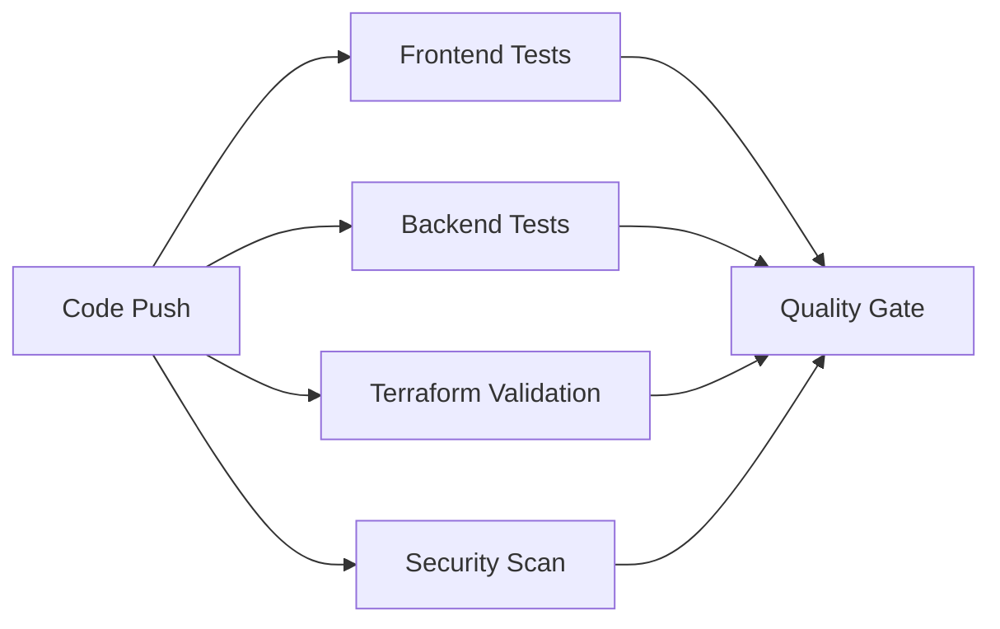
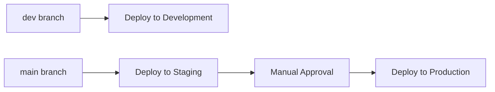

# CI/CD Pipeline Setup Guide

## 🎯 **Overview**

This guide explains the GitHub Actions CI/CD pipeline for the Site Generator Platform. The pipeline automates testing, security scanning, and deployment across multiple environments.

## 🏗️ **Pipeline Architecture**

### **Workflow Files**
- `.github/workflows/test.yml` - Automated testing and quality checks
- `.github/workflows/deploy.yml` - Production deployment pipeline  
- `.github/workflows/setup-environments.yml` - Environment configuration

### **Pipeline Stages**

#### **1. Continuous Integration (CI)**
Triggered on every push and pull request:



- **Frontend Tests**: ESLint, TypeScript compilation, Jest unit tests, build validation
- **Backend Tests**: TypeScript compilation, Jest unit tests for Lambda functions
- **Terraform Validation**: Format check, validate syntax, security scan with tfsec
- **Security Scan**: Trivy vulnerability scanner, Gitleaks secret detection

#### **2. Continuous Deployment (CD)**
Triggered on pushes to protected branches:



## 🔧 **Setup Instructions**

### **Step 1: Repository Secrets**
Add these secrets to your GitHub repository:

```bash
# Required AWS Credentials
AWS_ACCESS_KEY_ID=<your-aws-access-key>
AWS_SECRET_ACCESS_KEY=<your-aws-secret-key>
AWS_ACCOUNT_ID=<your-aws-account-id>

# Optional integrations
SLACK_WEBHOOK_URL=<webhook-for-notifications>
DATADOG_API_KEY=<monitoring-integration>
```

### **Step 2: Environment Setup**
Run the environment setup workflow:

1. Go to **Actions** tab in your repository
2. Select **"Setup GitHub Environments"** workflow
3. Click **"Run workflow"**
4. Choose `environments` to create dev/staging/prod environments

### **Step 3: Branch Protection**
Set up branch protection rules:

1. Run the setup workflow again with `branch-protection` option
2. Or manually configure in **Settings** > **Branches**

### **Step 4: Pre-commit Hooks (Optional)**
Install pre-commit hooks for local development:

```bash
# Install pre-commit
pip install pre-commit

# Install hooks
pre-commit install

# Run manually
pre-commit run --all-files
```

## 🌍 **Environment Configuration**

### **Development Environment**
- **Branch**: `dev`
- **Auto-deploy**: ✅ On every push to dev
- **Approval**: ❌ None required
- **Purpose**: Testing new features

### **Staging Environment**  
- **Branch**: `main`
- **Auto-deploy**: ✅ On push to main
- **Approval**: ⏱️ 5-minute wait timer
- **Purpose**: Pre-production validation

### **Production Environment**
- **Branch**: `main` 
- **Auto-deploy**: ❌ Manual trigger only
- **Approval**: ⏱️ 30-minute wait timer
- **Purpose**: Live production system

## 🧪 **Testing Strategy**

### **Frontend Tests**
```typescript
// Jest configuration in frontend/jest.config.js
// Tests located in frontend/__tests__/
// Coverage: Components, utilities, templates
```

### **Backend Tests**
```typescript
// Jest configuration in each Lambda function directory
// Tests located in backend/*/__tests__/
// Coverage: API handlers, business logic, error handling
```

### **Infrastructure Tests**
```hcl
# Terraform validation
terraform fmt -check
terraform validate
tfsec infrastructure/
```

## 🔒 **Security Measures**

### **Automated Security Scanning**
- **Trivy**: Vulnerability scanning for dependencies
- **Gitleaks**: Secret detection in code
- **tfsec**: Terraform security analysis
- **ESLint**: Code quality and security rules

### **Access Control**
- **Branch Protection**: Requires PR reviews and status checks
- **Environment Protection**: Wait timers and approval gates
- **Secret Management**: GitHub Secrets for sensitive data
- **Least Privilege**: Limited AWS permissions for deployments

## 📊 **Monitoring and Observability**

### **Deployment Tracking**
- GitHub Actions logs for all deployments
- Terraform state tracking
- AWS CloudWatch for application logs
- Deployment status notifications

### **Quality Metrics**
- Test coverage reports
- Security scan results  
- Build success rates
- Deployment frequency

## 🚀 **Deployment Process**

### **Development Deployment**
```bash
# Automatic on dev branch push
git push origin dev
```

### **Staging Deployment** 
```bash
# Automatic on main branch push
git checkout main
git merge dev
git push origin main
```

### **Production Deployment**
```bash
# Manual trigger in GitHub Actions
# 1. Go to Actions tab
# 2. Select "Deploy Site Generator Platform"
# 3. Click "Run workflow"
# 4. Select "production" environment
```

## 🔧 **Troubleshooting**

### **Common Issues**

#### **Failed Tests**
```bash
# Run tests locally
cd frontend && npm test
cd backend/api/create-deployment && npm test
```

#### **Terraform Errors**
```bash
# Validate infrastructure locally
cd infrastructure
terraform init
terraform validate
terraform plan
```

#### **Security Scan Failures**
```bash
# Run security scans locally
trivy fs .
gitleaks detect --source .
tfsec infrastructure/
```

#### **Deployment Failures**
1. Check AWS credentials and permissions
2. Verify Terraform state is not locked
3. Check CloudWatch logs for Lambda errors
4. Validate S3 bucket policies

### **Pipeline Status**
Monitor pipeline health at:
- **GitHub Actions**: Repository > Actions tab
- **AWS CloudWatch**: Deployment logs and metrics
- **Terraform Cloud**: State management (if configured)

## 📋 **Maintenance Tasks**

### **Weekly**
- Review security scan results
- Update dependencies with security patches
- Monitor deployment success rates

### **Monthly**  
- Update GitHub Actions versions
- Review and rotate AWS credentials
- Analyze infrastructure costs
- Update documentation

### **Quarterly**
- Major dependency updates
- Security audit and penetration testing
- Disaster recovery testing
- Performance optimization review

## 🎯 **Next Steps**

To further improve the CI/CD pipeline:

1. **Add Integration Tests**: End-to-end testing with deployed infrastructure
2. **Implement Blue/Green Deployments**: Zero-downtime production deployments
3. **Add Performance Testing**: Load testing in staging environment
4. **Enhance Monitoring**: Custom metrics and alerting
5. **Add Chaos Engineering**: Resilience testing

This CI/CD pipeline provides a solid foundation for professional software delivery with automated testing, security scanning, and controlled deployments.